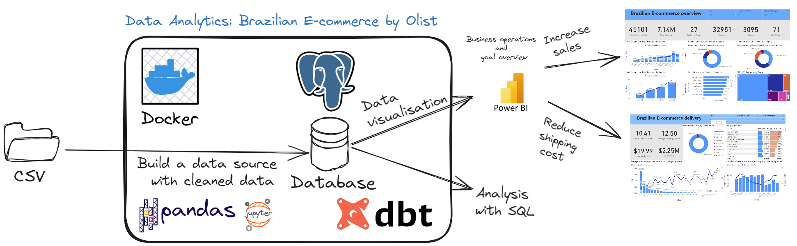
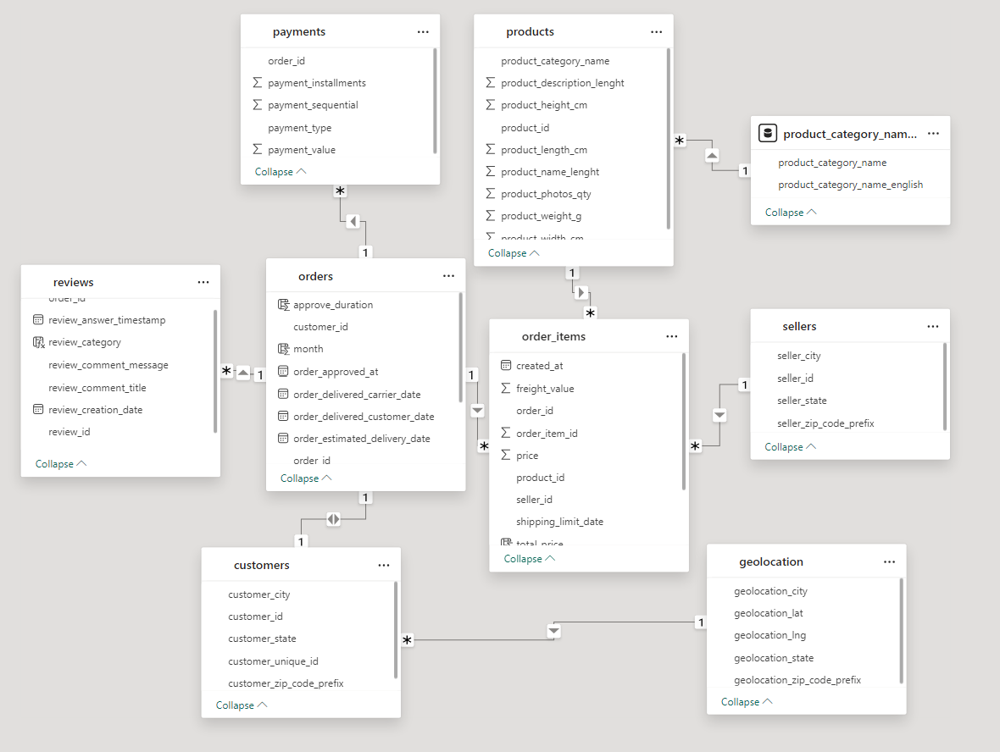
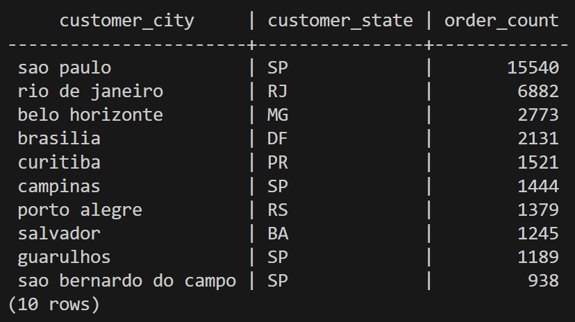
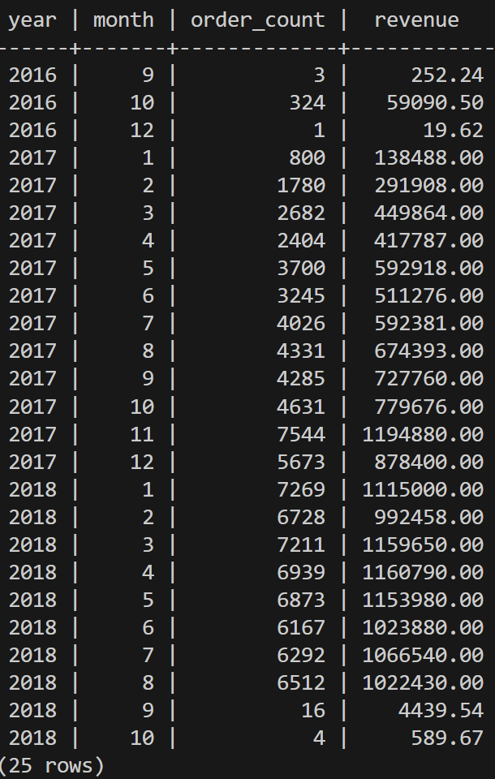
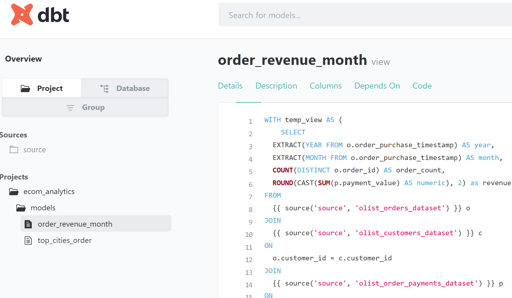
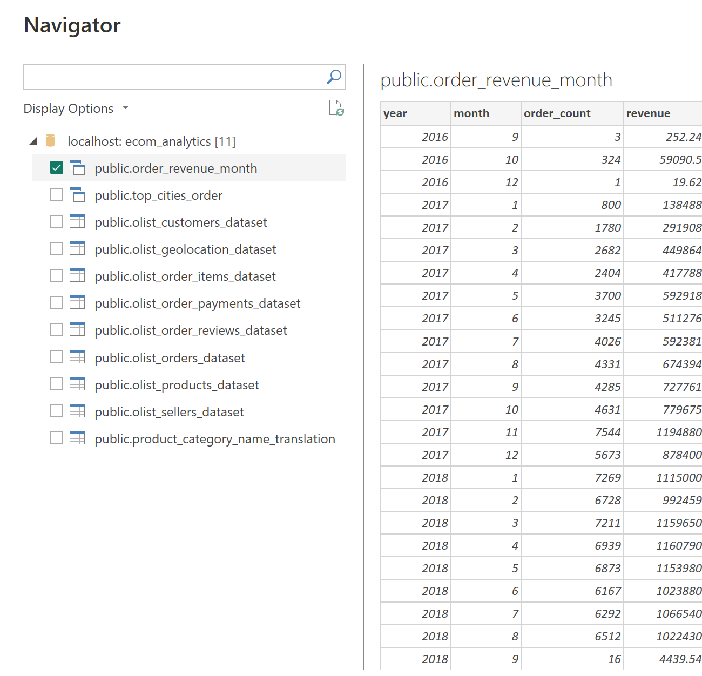

# data-analytics_brazilian-ecommerce_2020

## 💻 Installation

Follow these steps to get the project up and running on your local machine:

1. **Clone the repository**

   Clone the repository using git:

   ```bash
   git clone git@github.com:nmh4598/data-analytics_brazilian-ecommerce_2020.git
   ```

2. **Set up a virtual environment** (Optional)

    Here's how you can create a virtual environment:

   ```bash
   python3 -m venv env
   ```

   Activate the virtual environment:

   On Windows:

   ```bash
   source env/Scripts/activate
   ```

   On Unix or MacOS:

   ```ls
   source env/bin/activate
   ```
   Navigate to the project directory and install the required packages using pip:

   ```bash
   pip install -r requirements.txt
   ```
## Data exploration: explore, clean, describe dataset    
The data I'll analyze comes from Olist, a Brazilian e-commerce platform that connects small businesses to larger product marketplaces. Olist published a dataset containing `99441` orders from March 2016 to August 2018. The data is anonymized, so it doesn't contain names for buyers, sellers or products. Its features allow viewing orders from multiple dimensions: from order status, price, payment, and freight performance to customer location, product attributes and finally reviews written by customers. After thorough cleaning in Python using Pandas and Numpy, the data has been imported to PostgreSQL environment using the COPY command. The data wrangling process includes:

   - Handling duplicate values
   - Handling data types
   - Handling inconsistent data

## Prepare  data for PostgreSQL and PowerBI
The configuration sets up a PostgreSQL database container named `de_psql` with persistent data storage, environment variables from a `.env` file, and access from the host machine
```bash
docker compose up -d
```

Copy the `brazilian-ecommerce` directory and `schemas.sql` file from  local machine to the container `de_psql`
```bash
docker cp brazilian-ecommerce de_psql:/tmp/brazilian-ecommerce
```
Next step, we will create database ecom_analytics and import data from csv file
```bash
make to_psql
create database ecom_analytics;
\c ecom_analytics
\i /tmp/brazilian-ecommerce/schemas.sql
\i /tmp/brazilian-ecommerce/ingest_data.sql
\dt
```
Then, open Power BI Desktop:

- In Power BI Desktop, click on `Get Data `in the Home ribbon.
- Select `More` and then "PostgreSQL Database."
- In the "PostgreSQL Database" dialog box, enter the following information:
    - Server: `de_psql`
    - Database: `postgres`
    - Username: `admin`
    - Password: `admin123`

Now we can load the 9 tables into PowerBI and create a data model as follows:


## Data Analysis with SQL
1. Top 10 cities with the highest number of orders
```sql
ecom_analytics=# 
SELECT
  DISTINCT c.customer_city,
  c.customer_state,
  COUNT(o.customer_id) order_count
FROM
  olist_orders_dataset o
JOIN
  olist_customers_dataset c
ON
  o.customer_id = c.customer_id
GROUP BY
  1, 2
ORDER BY
  3 DESC;
```
Sao Paulo is the most populous and richest state in Brazil. Here, we can see that Sao Paulo state alone has 4 cities in the top 10 with the highest number of orders.

2. Number of orders and revenue placed each month across all years
```sql
SELECT
  EXTRACT(YEAR FROM o.order_purchase_timestamp) AS year,
  EXTRACT(MONTH FROM o.order_purchase_timestamp) AS month,
  COUNT(DISTINCT o.order_id) AS order_count,
  ROUND(CAST(SUM(p.payment_value) AS numeric), 2) as revenue
FROM
  olist_orders_dataset o
JOIN
  olist_customers_dataset c
ON
  o.customer_id = c.customer_id
JOIN
  olist_order_payments_dataset p 
ON
  o.order_id = p.order_id
GROUP BY
  year, month
ORDER BY
  year, month;
```
The data reveals a positive trend in Brazilian e-commerce, with both purchase count and revenue showing an upward trajectory. However, these trends are not entirely smooth, exhibiting some fluctuations along the way. To gain a more comprehensive understanding of this growth, we need to delve deeper into various factors influencing this dynamic landscape: **Customer Demographics**, **Customer Satisfaction**, **Seller Growth**,  **Payment Options**, **Delivery Time**, **Order Cancellations**


## Set up DBT 

```bash
dbt init ecom_analytics
```
- Enter a number: `1` (postgres)
- host (hostname for the instance): - `localhost`
- port [5432]:
- user (dev username): `admin`
- pass (dev password): `admin123`
- dbname (default database that dbt will - build objects in): `ecom_analytics`
- schema (default schema that dbt will - build objects in): `public`
```bash
cd ecom_analytics/
dbt debug
00:22:31  All checks passed! Yay
```

```bash
$ cat ~/.dbt/profiles.yml
```
```output
ecom_analytics:
  outputs:
    dev:
      dbname: ecom_analytics
      host: localhost
      pass: admin123
      port: 5432
      schema: public
      threads: 1
      type: postgres
      user: admin
  target: dev
```
```bash
$ cat ~/.dbt/profiles.yml
```
```bash
dbt run
dbt docs generate
dbt docs serve --port 8001
```

## Data Visualization with PowerBI

The next step of the project is to visualize the data and extract meaningful insights. The data visualization process includes:

- Numbers of orders
- Total revenue
- Number of customer state
- Number of products and product category
- Number of sellers
- Payment type
- Average processing hours
- Average shipping duration
- Average and sum freight (AOV)
- Total orders and total revenue by month and quarter
- Number of orders by review category: positive, negative, neutral
- Number of orders by hour category : dawn, night, morning, night
- Total revenue by product category
- % Top 10 revenue by State
- Customer by geography 
- Quantity, % quantity and revenue of product sold 
- Payment value by payment type 
- Number of order by order status 
- Average freight and number of orders of product category
- Average of shipping duration and sum of freight by state
- Number of orders and average of shipping duration by month

**Note**: Every time we create a new view in the database with dbt, we load it into PowerBI to visualize

